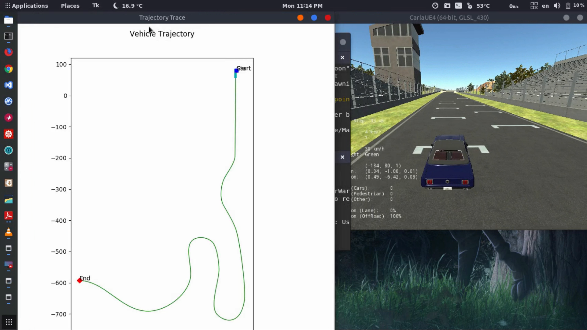

# Longitudinal and Lateral Control in CARLA 
This project is part of Coursera Self-Driving cars specialization.

### Video:
https://www.youtube.com/watch?v=_ONfGpo1h-4

----------------------------------
## How to run:

* `$ ./CarlaUE4.sh /Game/Maps/RaceTrack -windowed -carla-server -benchmark -fps=30 -ResX=640 -ResY=480`
* `$ python3 module_7.py `